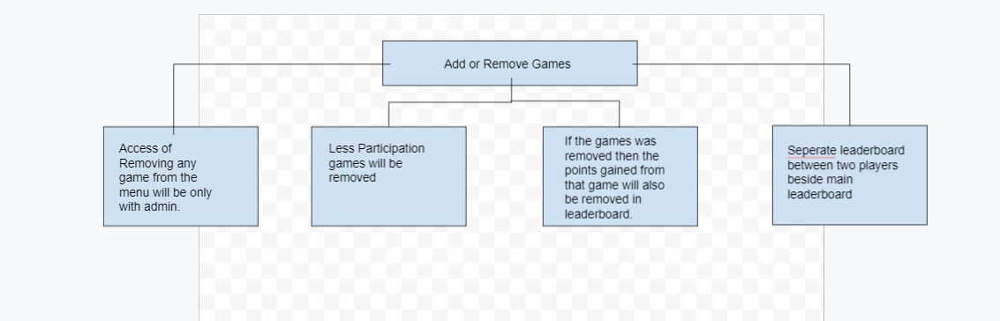

# Architecture

## Leaderboard Uml Diagrams

### STRUCTURAL DIAGRAMS 
 
 #### leaderboard class diagrams 
 

 #### leaderboard OBJECT DIAGRAM 
      

 #### leaderboard package DIAGRAM 
      

## Leaderboard BEHAVIORAL DIAGRAMS

 ### Leaderboard Use case diagram

## Add or remove Uml Diagrams

### STRUCTURAL DIAGRAMS 
 
 #### Add or remove class diagrams 
 

 #### Add or remove OBJECT DIAGRAM 
      

 #### Add or remove package DIAGRAM 
      

## Add or remove BEHAVIORAL DIAGRAMS

 ### Add or remove Use case diagram

## Export data Uml Diagrams

### STRUCTURAL DIAGRAMS 
 
 #### Export data class diagrams 
 

 #### Export data OBJECT DIAGRAM 
      

 #### Export data package DIAGRAM 
      

## Export data BEHAVIORAL DIAGRAMS

 ### Export data Use case diagram

